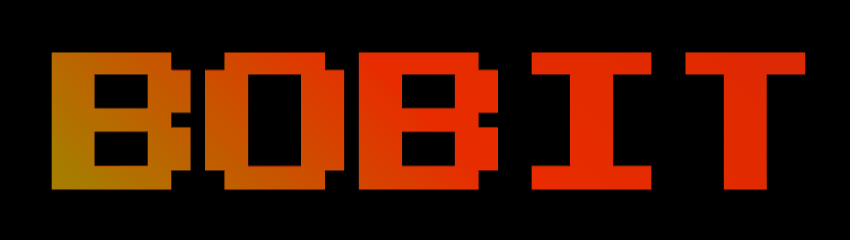

[🕹️BOBIT: https://bobitgame.herokuapp.com/](https://bobitgame.herokuapp.com/)

## Table of Contents
01. [Concept](#Concept)
02. [Graphic](#Graphic)
03. [Interaction](#Interaction)
04. [Libraries & tools](#Libraries-&-tools)
05. [Start screen](#Start-screen)
06. [Page Layout](#Page-Layout)
07. [Brick movement](#Brick-movement)
08. [Bricks/users interaction](#Bricks/users-interaction)
09. [Object collision](#Object-collision)
10. [Score & touchpoints](#Score-&-touchpoints)
11. [Beating effect](#Beating-effect)
12. [team](#Team)

## **Concept**

**BOBIT** is the project of a game developed using p5.js as final project for the Creative Coding course at Politecnico di Milano. The first input was to create a webpage where people could interact with each other in order to reach a common goal. That's how bobit was created! We decided to build an old arcade game, with simple rules that everybody know but with a differece, instead of playing alone, everybody can join the game and collaborate with all the others players to reach the highest score. The aim of the game aren't just the points but also being able to work with the others during an activity that we usually do by ourself.

## **Graphic**

Bobit graphic reminds the old games like brick breaker, bounce and pacman. Everything from the background, the ball, the brick and even the site font ( Press Start 2P ) is designed to reseamble and to bring the player back to a games room in the eighties.
In order to add some difficulties the levels have trippy graphics that distract the player from the ball and the brick which, most of the time, blend in the background. The levels , going two by two, have three different themes that all together create a storytelling, from a domestic habitat in the first and second levels, through the aliens and ufo sigthings and the reach of the Space, to the total abstraction of the final two levels.


## **Interaction**

Bobit is designed to be played on computer only. The player can easily interact with the brick  just using dragging on the touchbar or using the mouse. The idea was to keep it as simple as possible in order to let the player focus on the game only.

## **Libraries & tools**

**LIBRARIES**

_p5.min.js
_p5.sound.js

**TOOLS**

_node.js
_socket.io

## **Start screen**

Opening the game page, before starting to play you will see this opening page containing the game rules, after reading it you only have to click to star playing.


## **Page layout**

The game page layout is designed is order t make everything visible and accesible. On the top-letf corner you can find the game rules and below the settings for the fullscreen mode, and for turning ON and OFF the music theme and the sound effects.
In the central part of the page there is the game square while on the right there are all the references to the currents points, the highscore and the scorebar that shows the level.


**MUSIC**

The music as well is designed to recreate the atmosphere of and eighties gamer room. The theme music is an 8 bit song, going on loop that reseamble the sountracks of the old video games and with its fast ritm helps the players to keep up.
The player can both decide to MUTE/UNMUTE the theme music and the bouncing sound effect, of course we suggest you to listen to it.

```
function MuteMusic() { //
  if (music.isLooping()) {
    music.pause();
    select('#btnMute').style('color', '#e94e1a');
    select('#btnMute').html('× Music');
  } else {
    music.loop();
    select('#btnMute').style('color', 'white');
    select('#btnMute').html('√ Music');
  }
}

function ToggleSoundEffects() { //
  if (soundEffects == true) {
    soundEffects = false;
    select('#btnSoundEffects').style('color', '#e94e1a');
    select('#btnSoundEffects').html('× Sound Effects');
  } else {
    soundEffects = true;
    select('#btnSoundEffects').style('color', 'white');
    select('#btnSoundEffects').html('√ Sound Effects');
  }
}
```
## **Brick movement**


The brick is controlled by the player using the touchbar/mouse. Our aims was to avoid the classic keyboard interaction in favor of a more fluent movement. The gamer can always see the arrow and how it interact and influence the brick motion. To avoid following the perimeter the player can move the arrow in every part of the screen because its X and Y position are calculated and projected along the perimeter itself.

```
function bricks() {
  this.bX = 0;
  this.bY = 0;
  this.bW = 200;
  this.bH = 50;
  var k = height / width;
  
  //brick move
  this.brickMove = function () {
    var m = k * mouseX - mouseY;
    var n = height - k * mouseX - mouseY;
    var a = mouseX - width / 2;
    var b = mouseY - height / 2;

    //mouseXY -> project brick position
    if (m * n > 0) {
      this.bW = 200;
      this.bH = 50;
      if (b > 0) {
        this.bY = height;
        this.bX = height / 2 * a / b + width / 2;
      } else {
        this.bY = 0;
        this.bX = -height / 2 * a / b + width / 2;
      }
    } else if (m * n < 0) {
      this.bW = 50;
      this.bH = 200;
      if (a > 0) {
        this.bY = width / 2 * b / a + height / 2;
        this.bX = width;
      } else {
        this.bY = -width / 2 * b / a + height / 2;
        this.bX = 0;
      }
    } else {
      this.bX = -500;
      this.bY = -500;
    }
  }
  
```
## **Bricks/users interaction


The game is built to allow and invite the collaboration between each user. Starting from a traditional single player game, we redesigned it to connect different players is something that is well known to everybody. Each time a new player logs in the width of the bricks decreases in proportion of the total gamers number. 
In case of a huge amount of player, the brick won't get smaller than the 20% of the width of the original single brick. 

Sketch.js part
```
  brickWidthPercentage = 0.8 / numOfPlayer + 0.2;
```
Server.js part
```
 io.on("connection", function (socket) {
  playerNum = io.eio.clientsCount;
});
```
## **Object collision**


One of the main part of the costruction of the game code was to find a way to make the ball bouncing back when it touches the brick. 
Starting from the library p5.collide2D we re-constructed it and recode it in the server.js part since p5 libraries doesn't work in the node server. The user playing records the data of the brick position sending it to the server that sends back the ball position and the score and highscore uptade, so if the ball fall also the touchpoint is influenced. The server also give back information about the numebr of player connected in that moment (so also the numer of bricks) that influence the brick width (every time a new player logs in the page, the others players bricks get shorter).
In order to increase the visual interaction between the brick adn the ball, when they collide, also the brick bounces following the ball movement.
```
// on server.js
// collide

function collideBall(_bkX, _bkY, _blX, _blY) {
  if (Math.pow(_bkX - _blX, 2) + Math.pow(_bkY - _blY, 2) <= 12100) {
    if (_blY <= 41 && _blY >= 0 || _blY >= 959 && _blY <= 1000) {
      if (abs(_blX - _bkX) <= 16 + brickWidth / 2) {
        collideStatus = true;
        console.log("Collide!" + _bkX + " " + _bkY + " " + _blX + " " + _blY);
      }
    }

    if (_blX <= 41 && _blX >= 0 || _blX >= 959 && _blX <= 1000) {
      if (abs(_blY - _bkY) <= 16 + brickHeight / 2) {
        collideStatus = true;
        console.log("Collide!" + _bkX + " " + _bkY + " " + _blX + " " + _blY);
      }
    }
  }
}

```

## **Score & touchpoints**


Just like in every other arcade game, we wanted to show not just the current score but also the highest ever reached. On the right part of the screen the user will always be able to see this datas.
**Score**The current score represent the total number of bouncing of the ball on every brick, no matter how many player are logged in and it's send directly from the server.js. The server receiveng the datas about the current location of the bricks is able to detect the collision and if that condition in true `if (collideStatus == true) {  score++;` the score increases. When the score reaches and overcomes the highscore, its values uptades with the new goal. `if (score > highscore) {  highscore = score; } `

```
// server.js
// score & highscore

function scorechange() {

  if (collideStatus == true) {
    score++;
    if (brickXPosition == 0 || brickXPosition == 1000) {
      ballxSpd = (500 - ballxPos) / (500 * Random(0.75, 2));
      ballySpd = Random(Constrain(-brickYPosition / 500, -1, 0), Constrain(2 - brickYPosition / 500, 0, 1));
    } else {
      ballySpd = (500 - ballyPos) / (500 * Random(0.75, 2));
      ballxSpd = Random(Constrain(-brickXPosition / 500, -1, 0), Constrain(2 - brickXPosition / 500, 0, 1));
    }
  }

  for (i = 0; i < 7; i++) {
    if (score < touchpoint[i]) {
      if (i > 1) {
        lastLevelScore = touchpoint[i - 2];
      } else {
        lastLevelScore = 0;
      }
      break;
    } else if (score >= touchpoint[6]) {
      lastLevelScore = touchpoint[4];
      break;
    }
  }

  if (score > highscore) {
    highscore = score;
  }

  if (abs(ballxPos - 500) > 600 || abs(ballyPos - 500) > 600) {
    ballxPos = Random(350, 650);
    ballyPos = Random(350, 650);
    score = lastLevelScore;
    fallStatus = true;
    console.log("Fall!");
  }
}

```
**Touchpoints**


We defined some values `var touchpoin = [0,5,10,15,20,25,30]` to reach in order to pass to the following touchpoint and level. When the players overcome the touchpoint, the background, the brick and the ball change design. One reached a touchpoint if the ball fall, the game will start again from the lastest one, without starting from the begginig. Of course is the players keep letting the ball falling, they will have to start from lowest points.
```
./sketch.js

var touchpoin = [0,5,10,15,20,25,30]
 
function ResetTouchPt() {
  //initial touchpoint
  select('#lvl1').html('▇');
  select('#lvl2').html('▇');
  select('#lvl3').html('▇');
  select('#lvl4').html('▇');
  select('#lvl5').html('▇');
  select('#lvl6').html('▇');
}

function touchPt() {
  lvl = "#lvl1";
  var i;
  for (i = 0; i < 7; i++) {
    if (score < touchpoint[i]) {
      lvl = "#lvl" + i;
      if (i > 1) {
        prevscore = touchpoint[i - 2];
      } else {
        prevscore = 0;
      }
      break;
    } else if (score >= touchpoint[6]) {
      lvl = "#lvl6";
      break;
    }
  }
  ResetTouchPt();
  select(lvl).html('👉▇');
}


```

## **Beating effect**

Some of the elements of the page have a beating effect that reseamble the bounce of the ball on the brick. The backgrounds of the different levels as well the touchpoint score bar keep moving increasing the general trippy/optical effect.

Touchpoint beating effect
```
//making touchpoint beat
css
 .touchPoint {
      animation-name: letterspa;
      animation-duration: 0.15s;
      animation-iteration-count: infinite;
      animation-direction: alternate;
    } 
    
    @keyframes letterspa {
      0 {
        letter-spacing: 0px;
      }

      100% {
        letter-spacing: 2px;
      }
}
```
Background beating effect
```
push();
  translate(width / 2, height / 2);
  scale((sin(millis() * PI / 150) + 1) * 0.003 + 1);
  translate(-width / 2, -height / 2);
  image(bgArr[currentLevel - 1], 500, 500, 1000, 1000);
  pop();
```
## **Team**


Chen Cheng-Hsin

Wu Di

Ana Flàvia Magalhaes

Francesca Mauri
